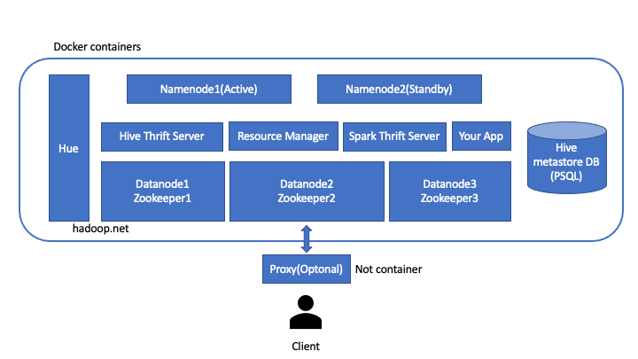

# Docker hadoop cluster
This is hadoop docker cluster for test purpose. 
It's not Psuedo-Distributed, but normal distributed hadoop cluster. If you want to build Hadoop Apps, this cluster can be good to test your app.  
Basically Frameworks on top of hadoop in this cluster is based on my company tech stack.  
This project was forked from [docker-hadoop](https://github.com/big-data-europe/docker-hadoop).

# Diagram

# **Frameworks Version**  
|  Framework      |  Version  |              |
|-----------------|-----------|--------------|
|  Hadoop         |  3.3.0    |              |
|  Hive           |  3.1.2    |              |
|  Spark          |  3.1.0    |  Scala 2.13  |
|  Hue            |  4.9.0    |              |
|  Trino(Presto)  |           |  TODO        | 
|  Airflow        |           |  TODO        |
    

# **Predefined Users**  
Users are defined in [base](./base/Dockerfile) image
|  Username  |  Password  |  is proxy?  |  Description  |
|------------|------------|-------------|--------|
|  hdfs      |  hdfs      |    -        |  Super user  |
|  webhdfs   |  webhdfs   |    Y        | Webhdfs service user |
|  hive      |  hive      |    Y        |  Hive service user  |
|  trino     |  trino     |    Y        |  Trino service user  |
|  kafka     |  kafka     |    Y        |  Kafka service user  |
|  hue       |  hue       |    Y        |  Hue service user  |
|  spark     |  spark     |    Y        |  Spark service user  |
|  svc       |  svc       |    Y        |  User's service user  |
|  ml_user   |  ml_user   |    N        |  ml team user  |
|  bi_user   |  bi_user   |    N        |  bi team user  |
|  dev_user  |  dev_user  |    N        |  dev team user  |

# How does it work?

# How to add / remove datanode?

# Limitations
- Namenode HA is not available
- Federation is not available
- Trino
- Client outside container can use only WebHDFS

# TODO
- Apache Iceberg
- Make Trino work

